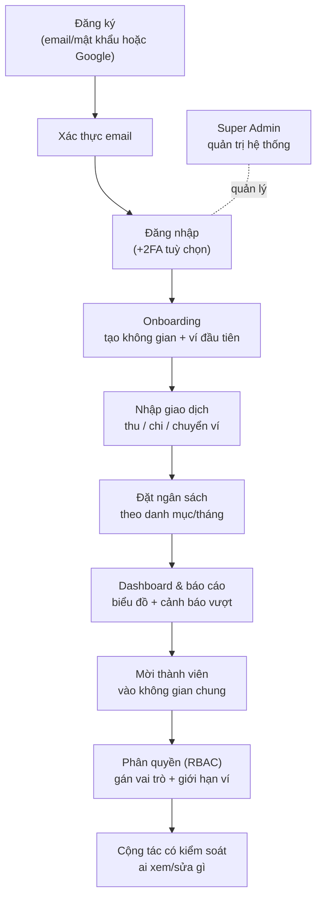
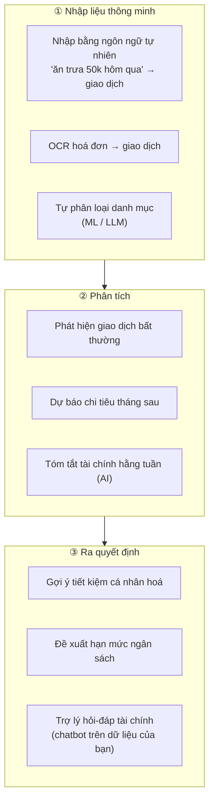
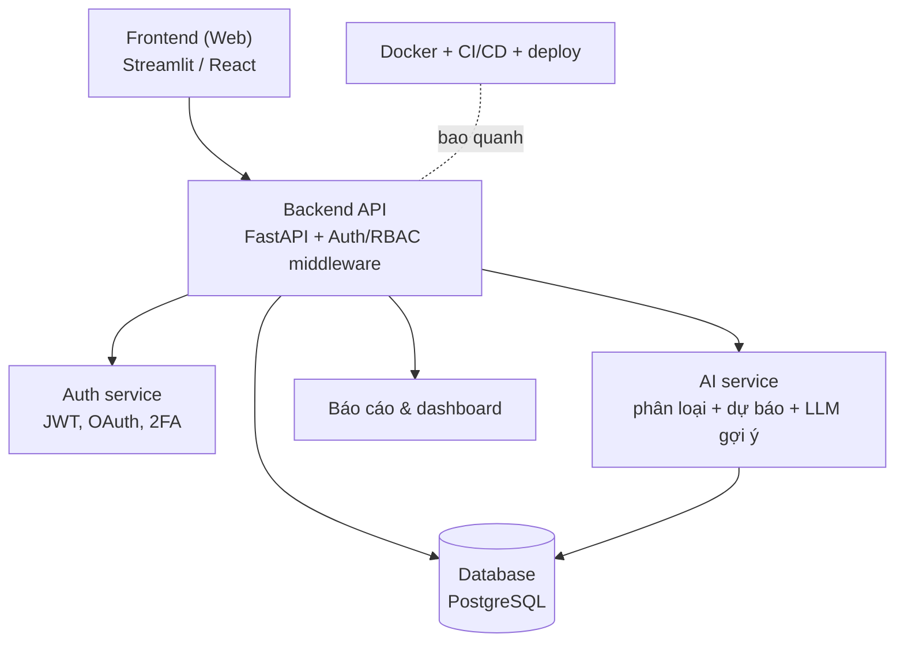

# Budget Planner — Product Description (sản phẩm hoàn chỉnh end-to-end)

Mô tả sản phẩm cho một **ứng dụng quản lý ngân sách & chi tiêu hoàn chỉnh**: từ **đăng ký / đăng nhập** → quản lý tài chính → **chia sẻ hộ gia đình** → **phân quyền (Role-Based Access Control, RBAC)** → quản trị hệ thống. Đây là hướng sản phẩm đầy đủ (Plan B); AI là trụ cột cốt lõi.

---

## 1. Tóm tắt sản phẩm

> **One-liner:** "Trợ lý tài chính AI cho cá nhân và hộ gia đình: ghi chép bằng ngôn ngữ tự nhiên, tự phân loại, dự báo & gợi ý tiết kiệm — an toàn, trực quan, có phân quyền rõ ràng."

- **Tên (đề xuất):** Budget Planner (codename).
- **Dạng:** Web app (responsive) + REST Application Programming Interface (API); có thể mở rộng mobile sau.
- **Người dùng:** cá nhân, cặp đôi, hộ gia đình, nhóm ở ghép — nhiều người **cùng một không gian tài chính** với quyền khác nhau.
- **Giá trị cốt lõi:** ghi chép nhanh (kể cả bằng câu nói) → **AI tự phân loại & phân tích** → thấy bức tranh chi tiêu → **dự báo + gợi ý tiết kiệm** → cùng quản lý mà vẫn **kiểm soát ai xem/sửa gì**.

> [!IMPORTANT]
> **Sản phẩm AI-first.** AI không phải tính năng phụ — nó là **trụ cột xuyên suốt** (xem Mục 9): nhập liệu bằng ngôn ngữ tự nhiên, tự phân loại giao dịch, phát hiện bất thường, dự báo chi tiêu, trợ lý hỏi-đáp tài chính, và gợi ý tiết kiệm cá nhân hoá.

---

## 2. Bối cảnh & nghiên cứu thị trường

| Sản phẩm | Điểm mạnh học hỏi | Ghi chú |
|---|---|---|
| **YNAB** | Zero-based budgeting ("give every dollar a job", "age your money") | Ngân sách phong bì; nhược: học phí cao, khó với người mới |
| **Monarch Money** | Hỗ trợ hộ gia đình thật: vai trò Admin / Member; danh mục hiện đại | Mô hình cộng tác nhiều người |
| **Spendee / Money Lover** | Theo dõi thu/chi, ngân sách thông minh, chia sẻ ví, theo dõi dòng tiền | UX nhập liệu nhanh |
| **Firefly III** (mã nguồn mở) | Budgets + categories + tags, giao dịch định kỳ, quy tắc tự phân loại, dashboard, REST JSON API, self-hosted | Tham khảo kiến trúc & data model |
| **Actual Budget** (mã nguồn mở) | Envelope budgeting, kiến trúc local-first + lớp đồng bộ, privacy | Cách tổ chức ngân sách |
| **Koody / Quicken** | Vai trò Owner / Editor / Viewer; mời nhiều người vào 1 ngân sách chung | Mô hình phân quyền |

> [!TIP]
> **Điểm khác biệt của ta:** đa số app chỉ có 2–3 vai trò đơn giản. Sản phẩm này làm **RBAC bài bản theo từng tài nguyên** (ví / danh mục / báo cáo), giới hạn theo "không gian" (workspace/household), **và lấy AI làm trung tâm**.

---

## 3. Mục tiêu & ngoài phạm vi

**Mục tiêu**
- Đăng ký/đăng nhập an toàn, hỗ trợ OAuth Google + xác thực 2 lớp (Two-Factor Authentication, 2FA).
- Quản lý nhiều ví/tài khoản, giao dịch, danh mục, ngân sách, giao dịch định kỳ.
- Dashboard + báo cáo trực quan; cảnh báo vượt ngân sách.
- Không gian dùng chung (household) + phân quyền theo vai trò.
- **AI là cốt lõi (bắt buộc):** tự phân loại, nhập ngôn ngữ tự nhiên, dự báo, trợ lý hỏi-đáp, gợi ý tiết kiệm.

**Ngoài phạm vi giai đoạn đầu**
- Kết nối ngân hàng thật (bank aggregation) — rủi ro pháp lý/bảo mật.
- Đa tiền tệ phức tạp, đầu tư/chứng khoán.
- App mobile native (chỉ web responsive trước).

---

## 4. Personas

| Persona | Nhu cầu | Vai trò điển hình |
|---|---|---|
| Sinh viên / cá nhân | Ghi chi tiêu nhanh, biết tiền đi đâu, đặt hạn mức | Owner không gian cá nhân |
| Cặp đôi / vợ chồng | Cùng theo dõi chi tiêu chung, minh bạch | Owner + Admin/Member |
| Phụ huynh ↔ con | Cho con xem/ghi nhưng không cho sửa ngân sách | Owner + Viewer/Member giới hạn |
| Nhóm ở ghép | Chia hoá đơn chung, ai trả gì | Members ngang quyền trong 1 ví chung |

---

## 5. Luồng end-to-end (đăng nhập → phân quyền)



1. **Đăng ký:** email + mật khẩu (băm argon2/bcrypt) hoặc OAuth Google.
2. **Xác thực email:** link/OTP kích hoạt.
3. **Đăng nhập:** JSON Web Token (JWT) access + refresh; tuỳ chọn 2FA (TOTP); quên mật khẩu / đặt lại.
4. **Onboarding:** tạo Không gian (Space/Household) + ví; chọn tiền tệ, danh mục mặc định.
5. **Nhập giao dịch:** thêm/sửa/xoá; nhập tay, import Comma-Separated Values (CSV), hoặc **bằng ngôn ngữ tự nhiên (AI)**.
6. **Ngân sách:** hạn mức theo danh mục/tháng; cảnh báo vượt.
7. **Báo cáo:** dashboard, biểu đồ theo danh mục/thời gian, xu hướng.
8. **Mời thành viên:** lời mời qua email.
9. **Phân quyền:** Owner/Admin gán vai trò + (nâng cao) giới hạn theo ví.
10. **Cộng tác:** mọi hành động bị kiểm soát quyền; ghi nhật ký kiểm toán (audit log).

---

## 6. Phân quyền (RBAC) — phần trọng tâm

### 6.1. Hai tầng phân quyền
- **Tầng hệ thống:** Super Admin vận hành nền tảng (quản lý người dùng, cấu hình, log) — **không** truy cập dữ liệu tài chính riêng tư (privacy).
- **Tầng không gian:** mỗi Không gian có vai trò riêng; quyền giới hạn trong phạm vi không gian (space-scoped).

### 6.2. Vai trò trong một Không gian

| Vai trò | Mô tả |
|---|---|
| **Owner** | Người tạo. Toàn quyền: quản lý thành viên, billing, xoá không gian, chuyển nhượng owner. |
| **Admin** | Quản lý thành viên, ví, danh mục, ngân sách — không billing, không xoá không gian. |
| **Member / Editor** | Thêm/sửa/xoá giao dịch, xem ngân sách & báo cáo. Có thể bị giới hạn theo ví. |
| **Viewer** | Read-only toàn bộ. |
| **Guest/Accountant** (tuỳ chọn) | Chỉ xem báo cáo tổng hợp, không xem chi tiết nhạy cảm. |

### 6.3. Ma trận quyền

| Hành động \ Vai trò | Owner | Admin | Member | Viewer |
|---|:---:|:---:|:---:|:---:|
| Xem giao dịch / báo cáo | ✅ | ✅ | ✅ | ✅ |
| Thêm/sửa/xoá giao dịch | ✅ | ✅ | ✅* | ❌ |
| Tạo/sửa danh mục | ✅ | ✅ | ❌ | ❌ |
| Tạo/sửa ngân sách | ✅ | ✅ | ❌ | ❌ |
| Tạo/sửa ví | ✅ | ✅ | ❌ | ❌ |
| Mời / xoá thành viên | ✅ | ✅ | ❌ | ❌ |
| Đổi vai trò thành viên | ✅ | ◐** | ❌ | ❌ |
| Billing / gói dịch vụ | ✅ | ❌ | ❌ | ❌ |
| Xoá / chuyển nhượng không gian | ✅ | ❌ | ❌ | ❌ |

\* Member có thể bị giới hạn chỉ thao tác trên ví được gán. \*\* Admin đổi vai trò cho cấp thấp hơn, không nâng ai thành Owner.

> [!IMPORTANT]
> **Nguyên tắc enforce quyền:** mọi request kiểm tra *(user có quyền X trên tài nguyên Y trong không gian Z?)* ở **backend**; quyền gắn với (vai trò × không gian × tài nguyên), không hardcode theo user; không tin client (ẩn nút ở UI là chưa đủ); ghi audit log cho hành động nhạy cảm.

---

## 7. Xác thực & bảo mật

| Hạng mục | Thiết kế |
|---|---|
| Đăng ký/đăng nhập | Email + mật khẩu (băm argon2/bcrypt) · OAuth Google |
| Phiên | JWT access (ngắn hạn) + refresh (xoay vòng); đăng xuất thu hồi token |
| 2FA | Time-based One-Time Password (TOTP) qua Authenticator (tuỳ chọn) |
| Quên mật khẩu | Link/OTP đặt lại, hết hạn theo thời gian |
| Bảo vệ | Rate limit đăng nhập, khoá tạm khi sai nhiều, chống brute-force |
| Phân quyền | RBAC middleware (Mục 6) · kiểm tra server-side mọi request |
| Bảo mật dữ liệu | HTTPS, mã hoá mật khẩu, không log dữ liệu nhạy cảm, least-privilege |

---

## 8. Tính năng đầy đủ (theo module)

| Nhóm | Tính năng |
|---|---|
| **Auth & tài khoản** | Đăng ký, đăng nhập, OAuth, 2FA, quên mật khẩu, hồ sơ, đổi mật khẩu |
| **Không gian & thành viên** | Tạo không gian, mời/xoá thành viên, gán vai trò, chuyển nhượng owner |
| **Ví / tài khoản** | Nhiều ví (tiền mặt, ngân hàng, ví điện tử), số dư, chuyển ví |
| **Giao dịch** | Thêm/sửa/xoá, ghi chú, đính kèm, lọc/tìm, import CSV, giao dịch định kỳ |
| **Danh mục** | Danh mục tuỳ chỉnh (cha/con), quy tắc tự gán |
| **Ngân sách** | Hạn mức theo danh mục/tháng, mục tiêu tiết kiệm, cảnh báo vượt |
| **Báo cáo & dashboard** | Tổng quan, biểu đồ theo danh mục/thời gian, xu hướng, xuất PDF |
| **Thông báo** | Cảnh báo sắp/đã vượt ngân sách, nhắc giao dịch định kỳ (email/in-app) |
| **AI (cốt lõi)** | Tự phân loại, nhập ngôn ngữ tự nhiên, phát hiện bất thường, dự báo, trợ lý hỏi-đáp, gợi ý tiết kiệm → Mục 9 |
| **Quản trị (Super Admin)** | Quản lý người dùng, cấu hình hệ thống, xem audit log |

---

## 9. AI tích hợp — trụ cột sản phẩm

AI hiện diện ở cả 3 giai đoạn: lúc *nhập liệu*, lúc *phân tích*, và lúc *ra quyết định*.



| # | Tính năng AI | Bài toán AI | Kỹ thuật đề xuất |
|---|---|---|---|
| 1 | Tự phân loại giao dịch | Phân loại (classification) | ML (scikit-learn) trên text; hoặc LLM zero-shot |
| 2 | Nhập bằng ngôn ngữ tự nhiên | Trích xuất thông tin | LLM parse "ăn trưa 50k" → {amount, category, date} |
| 3 | Phát hiện bất thường | Anomaly detection | z-score / Isolation Forest |
| 4 | Dự báo chi tiêu | Hồi quy / chuỗi thời gian | Linear/Prophet/LightGBM theo lịch sử |
| 5 | Gợi ý tiết kiệm | Sinh ngôn ngữ có dữ liệu | LLM phân tích pattern → đề xuất cụ thể |
| 6 | Đề xuất hạn mức ngân sách | Khuyến nghị | Thống kê lịch sử + LLM diễn giải |
| 7 | Trợ lý hỏi-đáp tài chính | Hỏi-đáp trên dữ liệu (RAG / tool-calling) | LLM + truy vấn DB qua function calling |
| 8 | OCR hoá đơn (stretch) | Computer Vision | OCR → trích trường giao dịch |

**Khớp vai trò team:** AIE Data (dataset + nhãn + eval) · AIE Model (train/eval classifier + dự báo, thiết kế prompt) · AIE Pipeline (luồng data→model→serving) · Tech Leader (tích hợp AI service vào backend) · QA (kiểm thử độ chính xác + bẫy LLM).

> [!WARNING]
> **Dùng LLM trong tài chính cần cẩn trọng:** không để LLM tự bịa số tiền/danh mục — luôn cho người dùng xác nhận trước khi lưu; trợ lý hỏi-đáp phải dùng tool-calling/RAG truy vấn DB thật (không "đoán"); đo & log độ chính xác phân loại, có fallback rule khi AI không chắc; lưu ý chi phí token.

---

## 10. Mô hình dữ liệu (thực thể chính)

```text
User(id, email, password_hash, name, is_active, 2fa_secret, created_at)
Space(id, name, owner_id, currency, created_at)            # không gian/household
Membership(id, user_id, space_id, role, status)            # liên kết user↔space + vai trò
Wallet(id, space_id, name, type, balance)
Category(id, space_id, name, parent_id, type)              # thu/chi
Transaction(id, space_id, wallet_id, category_id, user_id, amount, type, date, note)
Budget(id, space_id, category_id, period, limit_amount)
RecurringRule(id, space_id, template, schedule)
AuditLog(id, space_id, actor_id, action, target, created_at)
```

Hầu hết thực thể gắn `space_id` → mọi truy vấn lọc theo không gian + kiểm tra quyền.

---

## 11. Kiến trúc & công nghệ



| Lớp | Công cụ đề xuất |
|---|---|
| Frontend | Streamlit (nhanh) hoặc React + Tailwind |
| Backend | FastAPI (Python) + Pydantic; middleware Auth + RBAC |
| Auth | JWT, OAuth2 (Google), TOTP 2FA, argon2 |
| Database | PostgreSQL + SQLAlchemy (SQLite cho dev) |
| AI | scikit-learn (phân loại/dự báo) · LLM (OpenAI) cho gợi ý |
| Hạ tầng | Docker, GitHub Actions, deploy Render/Railway/VPS |

---

## 12. Tiêu chí thành công

- Đăng ký → tạo không gian → nhập giao dịch đầu tiên < 3 phút.
- Phân quyền đúng: Viewer **không thể** sửa (kiểm thử bảo mật).
- Báo cáo phản ánh đúng số liệu (đối chiếu thủ công).
- AI tự phân loại đạt độ chính xác hợp lý trên tập test (accuracy/F1).
- Nhập ngôn ngữ tự nhiên parse đúng số tiền/danh mục ở đa số trường hợp.
- Trợ lý hỏi-đáp trả lời đúng dựa trên dữ liệu thật (không bịa số).

---

## 13. Lộ trình MVP → đầy đủ

| Phase | Nội dung | Ghi chú |
|---|---|---|
| **P0** | Auth + 1 không gian + ví + giao dịch + ngân sách + báo cáo cơ bản | lõi, hợp Module 1 |
| **P1** | **AI tự phân loại** + nhập ngôn ngữ tự nhiên | đưa AI vào sớm (giá trị cốt lõi) |
| **P2** | Mời thành viên + **RBAC** + audit log | phân quyền trọng tâm |
| **P3** | AI dự báo + gợi ý tiết kiệm + **trợ lý hỏi-đáp** | LLM + tool-calling trên DB |
| **P4** | Dashboard nâng cao + import CSV + thông báo + xuất PDF | |
| **P5** | 2FA, OAuth Google, Super Admin, OCR hoá đơn, bảo mật + deploy | |

> [!NOTE]
> **Cho Module 1:** nộp P0 + một phần P1 (đăng nhập + AI tự phân loại cơ bản) là vừa sức và **đã có AI** đúng yêu cầu. Thiết kế data model có `space_id` + `role` + chỗ cho AI service ngay từ đầu để không phải viết lại.

---

## Nguồn tham khảo
- [NerdWallet — Best Budget Apps 2026](https://www.nerdwallet.com/finance/learn/best-budget-apps)
- [Monarch — Couples & Households (roles)](https://help.monarch.com/hc/en-us/articles/20926382202004-Monarch-for-Couples-and-Households)
- [Firefly III (open source)](https://github.com/firefly-iii/firefly-iii)
- [Actual Budget](https://actualbudget.org/)
- [Koody — shared budgeting roles](https://koody.com/blog/shared-budgeting-app-for-couples)

> Bản đầy đủ (Obsidian) còn liên kết tới: 2 Plan, Kịch bản họp, Template Report, Tổng hợp vai trò.
